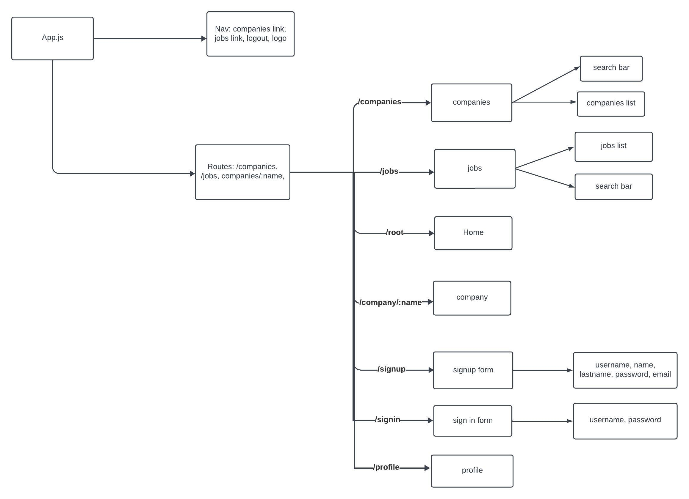

# React Jobly 
This web application enables uses to search for jobs. Users can sign up and 
view specific information about different companies, check the available positions in a company and apply for 
a job that they are interested in. 

Technologies used:
Backend: Node.js, Postgresql
Fronend: React, HTML, CSS

Here is a map of the components and routes that I created to begin the project:

